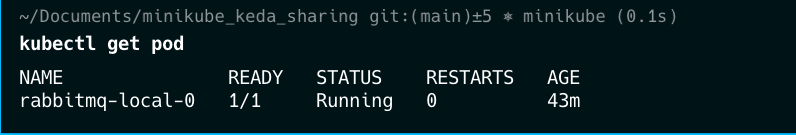
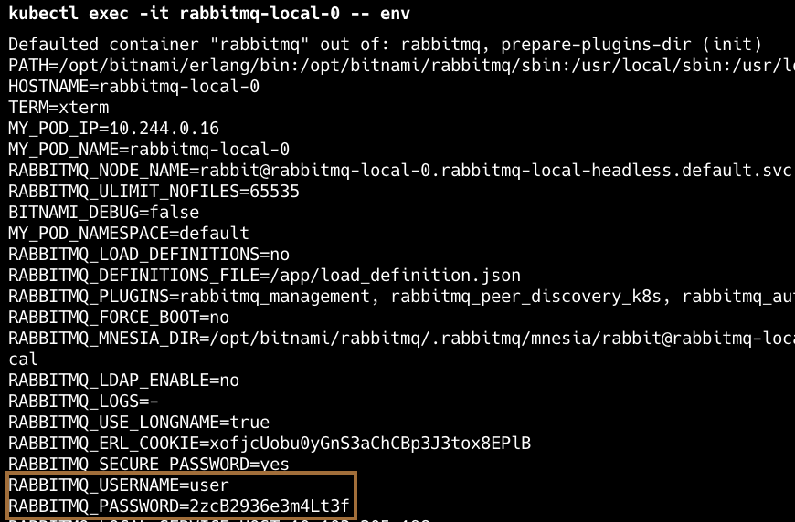

# Minikube keda sharing

## Prepare Environment

0. Install these tools
    - [kubectl](https://kubernetes.io/docs/tasks/tools/)
    - [helm](https://helm.sh/docs/intro/install/)
    - [lens](https://k8slens.dev/)

1. install minikube with brew

    ```bash
    brew install minikube
    ```

2. start minikube cluster

    ```bash
    minikube start
    ```

3. Install KEDA

    [KEDA Document](https://keda.sh/docs/2.14/deploy/)

    ```bash
    kubectl apply --server-side -f https://github.com/kedacore/keda/releases/download/v2.14.0/keda-2.14.0.yaml
    ```

4. Install RabbitMQ with Helm

    4.1 add repo bitnami to helm

    ```bash
    helm repo add bitnami https://charts.bitnami.com/bitnami
    ```

    4.2 use helm to install

    ```bash
    helm install rabbitmq-local bitnami/rabbitmq --version 14.4.4
    ```

    4.3 forward RabbitMQ Port

    ```bash
    kubectl port-forward --namespace default svc/rabbitmq-local 5672:5672
    ```

    ```bash
    kubectl port-forward --namespace default svc/rabbitmq-local 15672:15672
    ```

    4.4 retrieve user and password

    1. run command below to get pod

        ```bash
        kubectl get pod
        ```

        

    2. run command below to get environment of pod

        ```bash
        kubectl exec -it <pod-name> -- env
        ```

        

## Deploy our application


# Reference
- https://kubernetes.io/docs/tasks/run-application/horizontal-pod-autoscale/